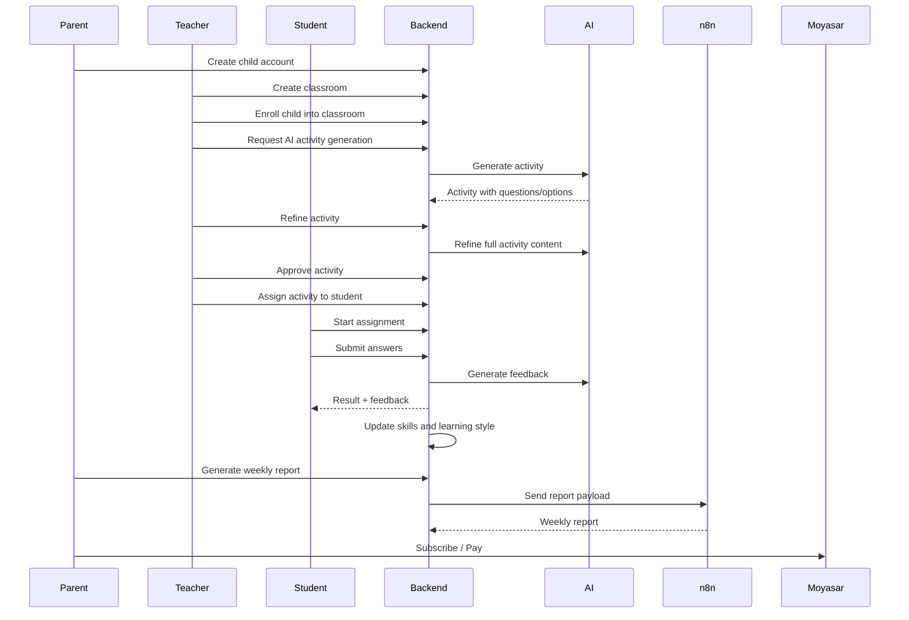

<h1 align="center">
  🎓 Qubaati | قبعتي
</h1>

<p align="center">
  <b>AI-powered adaptive learning platform for children</b><br/>
  <b>منصة تعليمية ذكية وتفاعلية للأطفال مدعومة بالذكاء الاصطناعي</b>
</p>


---
---

## 📌 Project Summary

### العربية

**قبعتي** هي منصة تعليمية ذكية وتفاعلية للأطفال، تساعد الطلاب على التعلم من خلال عوالم مهنية افتراضية مثل الطب، الهندسة، العلوم، التعليم وغيرها. يدخل الطالب إلى هذه العوالم وينفذ مهام وأنشطة تفاعلية وأسئلة تعليمية مبنية على القرارات.

يقوم النظام بتحليل أداء الطالب وسلوكه التعليمي وسرعة اتخاذ القرار ونقاط القوة والضعف والمهارات ونمط التعلم. يستطيع المعلم إنشاء أنشطة باستخدام الذكاء الاصطناعي، تعديلها، اعتمادها، ثم تعيينها للطلاب أو الفصول. كما يستطيع ولي الأمر متابعة تقدم أبنائه من خلال لوحات تحكم وتقارير أسبوعية يتم إنشاؤها بمساعدة n8n والذكاء الاصطناعي.

هدف قبعاتي هو تقديم تجربة تعليمية أعمق من مجرد الدرجات، تساعد الطفل على اكتشاف مهاراته وميوله واهتماماته المستقبلية.

### English

**Qubaati** is an AI-assisted educational platform designed for children, teachers, and parents. Students explore interactive career worlds such as medicine, engineering, science, teaching, and more. Inside each world, they complete missions, activities, questions, and decision-based learning experiences.

The system analyzes student performance, learning behavior, decision speed, strengths, weaknesses, skills, and learning style. Teachers can generate and refine AI-powered activities, assign them to students or classrooms, review progress, and provide feedback. Parents can monitor their children’s progress through dashboards and AI/n8n-generated weekly reports.

The goal of Qubaati is to move beyond traditional grades and provide a deeper, personalized learning experience that helps children discover their interests, skills, and future career tendencies.

---

## ✨ Key Features

* 👨‍👩‍👧 **Parent flow**
* Parent creates child account.
* Parent views child progress, activity results, mission history, learning profile, and weekly reports.
* Parent receives AI/n8n-generated weekly summaries.


* 👨‍🏫 **Teacher flow**
* Teacher creates classrooms.
* Teacher enrolls students into classrooms.
* Teacher generates AI activities.
* Teacher refines AI activities.
* Teacher approves/rejects activities.
* Teacher assigns activities to students or classrooms.
* Teacher grades, reviews, reopens, and gives feedback.


* 👧 **Student flow**
* Student starts assigned activities.
* Student submits answers.
* Student receives AI/system feedback.
* Student plays missions inside career worlds.
* Student receives recommendations.
* Student skills and learning style are updated automatically.


* 🤖 **AI-powered learning**
* AI activity generation.
* AI activity refinement.
* AI submission feedback.
* AI answer grading.
* AI teacher dashboard insight.
* AI parent dashboard insight.
* AI classroom summaries.
* AI learning analysis.


* 💳 **Subscription and payments**
* Moyasar checkout.
* Parent and teacher subscriptions.
* Subscription plans.
* Payment callback, status, and receipt.


* 🔐 **Security**
* HTTP Basic Auth.
* `@AuthenticationPrincipal User user`.
* Role-based authorization.
* Service-layer ownership checks.
* No path-variable IDs.
* Body-based target IDs.
* Thin controllers.


---

## 🛠️ Technologies and Tools Used

### Backend

| Technology | Purpose |
| --- | --- |
| Java 17 | Main programming language |
| Spring Boot 4.x | Backend framework |
| Spring Web | REST API development |
| Spring Data JPA | Database access layer |
| Hibernate | ORM |
| MySQL | Relational database |
| Spring Security | Authentication and authorization |
| Basic Auth | API authentication style |
| BCrypt | Password hashing |
| Spring Validation | DTO validation |
| Lombok | Boilerplate reduction |
| ModelMapper | Entity/DTO mapping |
| Jackson | JSON parsing and serialization |
| Maven / Maven Wrapper | Build and dependency management |

### AI and Automation

| Tool | Purpose |
| --- | --- |
| Spring AI | AI integration layer |
| OpenAI ChatClient | AI activity generation/refinement/feedback |
| n8n | Parent weekly report automation |
| Webhooks | Integration between Spring Boot and n8n |

### Payments

| Tool | Purpose |
| --- | --- |
| Moyasar | Payment checkout, status, callback, and receipt |
| Subscription plans | Parent/teacher subscription management |

### Development and Testing

| Tool | Purpose |
| --- | --- |
| Postman | API testing collection |
| Git / GitHub | Version control |
| IntelliJ IDEA | Development environment |
| Mermaid | README diagrams |

---

### Roles

| Role | Main Capabilities |
| --- | --- |
| `ADMIN` | Manage system data, generic CRUD, plans, worlds, missions, skills |
| `TEACHER` | Manage classrooms, activities, assignments, grading, dashboards |
| `PARENT` | Create children, view child progress, reports, subscriptions |
| `STUDENT` | Start assignments, submit answers, play missions, view recommendations |

---

## 🧠 AI Features

Qubaati uses AI to make learning more personalized.

| AI Feature | Description |
| --- | --- |
| Activity generation | Teacher generates activities using AI |
| Activity refinement | Teacher refines an activity using instructions |
| AI feedback | Student receives personalized feedback after submission |
| AI grading support | Free-text answers can be graded with AI support |
| Parent dashboard insight | Parent receives AI-powered child progress analysis |
| Teacher dashboard insight | Teacher receives AI-powered classroom insights |
| Classroom summary | AI summarizes classroom performance |
| Mission recommendations | Student receives learning recommendations |

AI is implemented using **Spring AI ChatClient**.

---

## 💳 Payment and Subscription

The system integrates with **Moyasar** for payments.

| Feature | Description |
| --- | --- |
| Checkout | Authenticated user starts checkout |
| Callback | Moyasar redirects/calls backend after payment |
| Status | User checks payment status |
| Receipt | User views payment receipt |
| Plans | Parent/teacher subscription plans |
| Limits | Free/paid limits for children and classrooms |

---

## 🔄 n8n Weekly Reports

Qubaati integrates with **n8n** to generate parent weekly reports.

---

# 👨‍💻 My Contribution

| Module | Features |
| --- | --- |
| 🤖 AI Learning Content Engine | Built the backend architecture for AI-powered activity generation and full activity content refinement using OpenAI ChatClient. |
| 📝 Activity Review & Distribution | Implemented the core workflow for activity approval, rejection, and revisions, alongside robust assignment logic (student, classroom, and bulk assignments). |
| ✍️ Submission & Grading System | Engineered the student assignment loop including batch answer saving, submission processing, and integration of AI to evaluate answers and generate feedback. |
| 👩‍🏫 Teacher Evaluation Tools | Developed endpoints for manual grading, returning submissions, reopening assignments, and tracking pending grading queues. |
| ⚙️ Admin Mission Setup | Implemented batch creation of mission steps, ensuring scalable routing logic for decision-based learning paths. |
| 👦 Student Dashboards | Created self-service endpoints mapping student activity data, skills tracking, and personalized dashboards. |

---

# 🔗 Git-Proven Endpoints I Implemented

## 🤖 AI Activity & Evaluation Core

| Method | Endpoint | Description |
| --- | --- | --- |
| `GET` | `/api/v1/ai/health` | Check AI provider status and connectivity. |
| `POST` | `/api/v1/ai/activities/generate` | Generate an educational activity using AI prompts. |
| `POST` | `/api/v1/ai/activities/refine` | Refine full activity content and questions using AI. |
| `POST` | `/api/v1/ai/activity-submissions/evaluate` | AI-evaluate a student submission for correctness. |
| `POST` | `/api/v1/ai/activity-submissions/generate-feedback` | Generate personalized AI feedback for a submission. |

## 🧪 Activity Review & Assignment Distribution

| Method | Endpoint | Description |
| --- | --- | --- |
| `POST` | `/api/v1/activities/approve` | Approve an activity for student assignment. |
| `POST` | `/api/v1/activities/reject` | Reject an activity in the review pipeline. |
| `POST` | `/api/v1/activities/request-revision` | Request a revision on an existing activity. |
| `POST` | `/api/v1/activity-assignments/assign-student` | Assign an approved activity to a single student. |
| `POST` | `/api/v1/activity-assignments/assign-classroom` | Assign an approved activity to an entire classroom. |
| `POST` | `/api/v1/activity-assignments/bulk` | Bulk assign activities across multiple targets. |
| `POST` | `/api/v1/activity-assignments/by-activity` | List assignments filtered by activity ID. |
| `POST` | `/api/v1/activity-assignments/cancel` | Cancel an active student assignment. |
| `POST` | `/api/v1/activity-assignments/extend` | Extend the due date for a specific assignment. |
| `POST` | `/api/v1/activity-assignments/expire-overdue` | System process to mark overdue assignments as expired. |
| `POST` | `/api/v1/activity-assignments/due-soon` | Trigger notifications for assignments due soon. |

## 📝 Activity Submissions & Grading Engine

| Method | Endpoint | Description |
| --- | --- | --- |
| `POST` | `/api/v1/activity-assignments/start` | Initialize and start an assignment for a student. |
| `POST` | `/api/v1/student-answers/batch` | Save student answers in batches during an activity. |
| `POST` | `/api/v1/activity-submissions/submit` | Finalize and submit an assignment for grading. |
| `POST` | `/api/v1/activity-submissions/result` | Retrieve the graded result of a submission. |
| `POST` | `/api/v1/activity-submissions/current` | Retrieve the current active submission for a student. |
| `POST` | `/api/v1/activity-submissions/feedback` | Retrieve teacher or AI feedback for a submission. |
| `POST` | `/api/v1/activity-submissions/by-activity` | List all student submissions for a specific activity. |
| `POST` | `/api/v1/activity-submissions/teacher-details` | Fetch detailed submission views for teacher evaluation. |
| `POST` | `/api/v1/activity-submissions/teacher-feedback` | Attach manual teacher feedback to a submission. |
| `PATCH` | `/api/v1/student-answers/grade` | Manually override or set a grade for an answer. |
| `POST` | `/api/v1/activity-submissions/return-to-student` | Return a submission requiring student corrections. |
| `POST` | `/api/v1/activity-submissions/reopen` | Reopen a previously closed/graded submission. |
| `POST` | `/api/v1/activity-submissions/pending-grading` | List submissions currently awaiting teacher review. |

## ⚙️ Mission Setup & Student Self-Service

| Method | Endpoint | Description |
| --- | --- | --- |
| `POST` | `/api/v1/missions/steps/batch` | Add complex mission routing steps in a single batch. |
| `POST` | `/api/v1/missions/steps/get` | Retrieve the steps architecture of a mission. |
| `DELETE` | `/api/v1/missions/steps/delete` | Delete mission steps. |
| `GET` | `/api/v1/students/me` | Fetch the authenticated student's base profile. |
| `GET` | `/api/v1/students/me/activity-dashboard` | Fetch the student's personal activity overview. |
| `GET` | `/api/v1/students/me/skills` | Fetch the current logged skills for the student. |

---

## 🚀 How to Run Locally

### 1. Clone the repository

```bash
git clone https://github.com/YOUR_USERNAME/qubaati-system.git
cd qubaati-system

```

### 2. Configure MySQL

Create a database:

```sql
CREATE DATABASE qubaati;

```

### 3. Configure environment variables

Set your database, AI, Moyasar, and n8n values.

Example:

```bash
export DB_USERNAME=root
export DB_PASSWORD=your_password
export OPENAI_API_KEY=your_openai_key

```

### 4. Build the project

```bash
./mvnw clean compile

```

### 5. Run the project

```bash
./mvnw spring-boot:run

```

The backend will run on:

```text
http://localhost:8080

```

---

## 🧭 Main Business Flow



---

## 🤍 Acknowledgment

Qubaati was built as an educational backend system to explore how AI, gamification, learning analytics, and secure backend design can improve personalized education for children.

> "Learning is not only about grades — it is about discovering potential."
